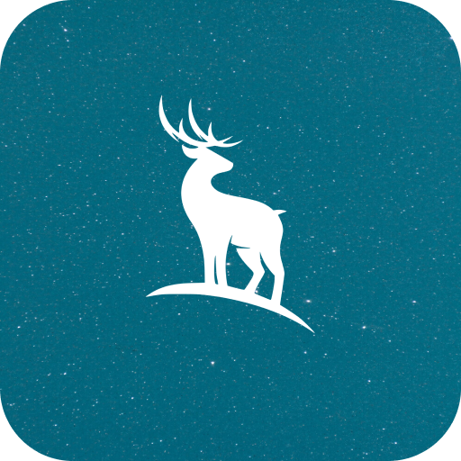
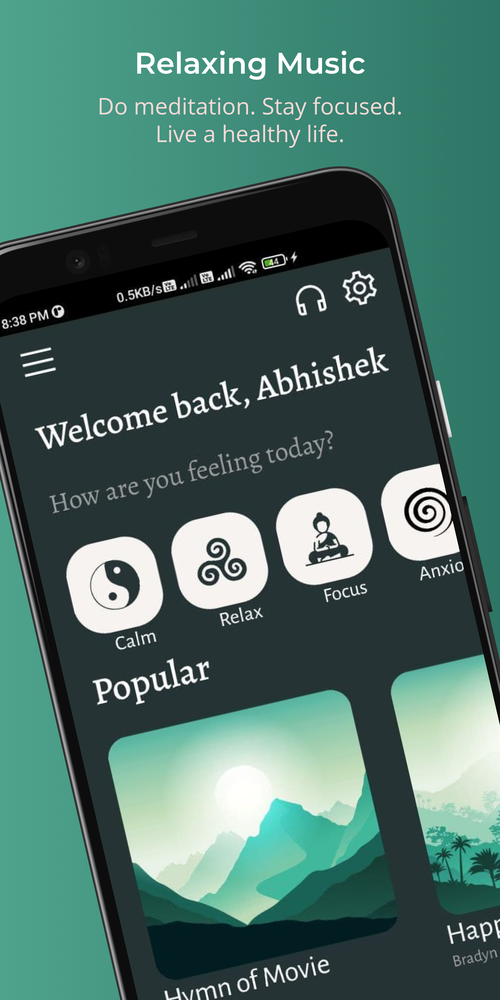
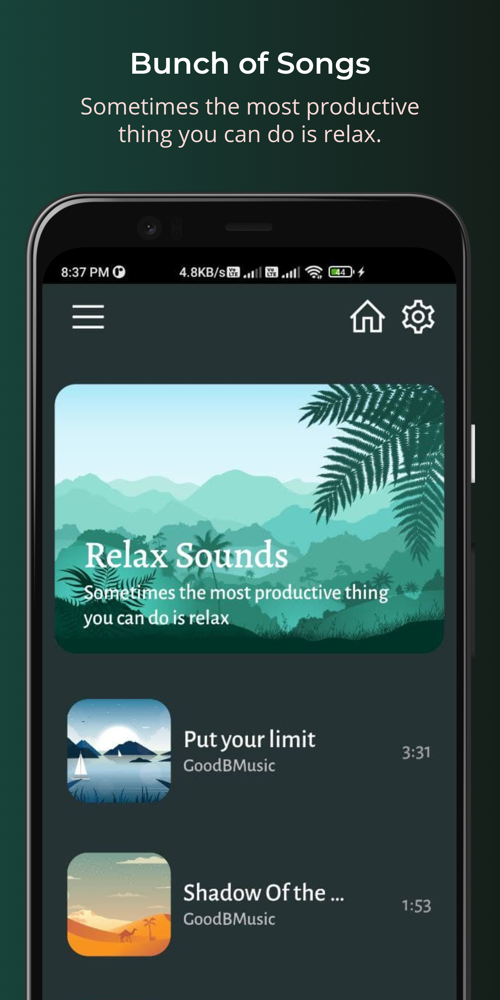
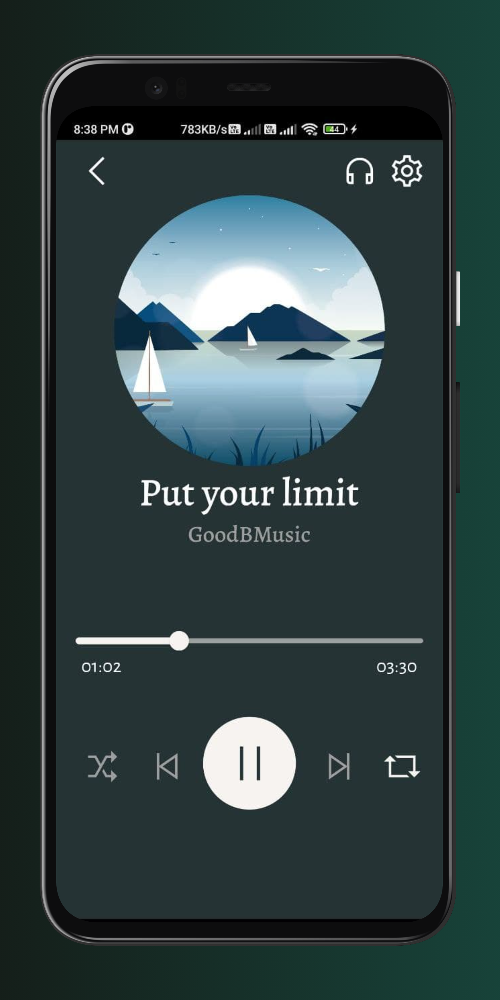

<h1 align="center">Luna</h1> 

<h3 align="center">Relaxing Music App</h3>
 

    
  
  
    
  

     

## Download 

## References

* [Figma assets](https://www.figma.store/download/medic-free-meditation-app-for-figma/)

* [Vectors](https://www.freepik.com/free-vector)

**If you like it, star this repo. If you find any issues, feel free to raise issues. Enjoy!** :upside_down_face:
